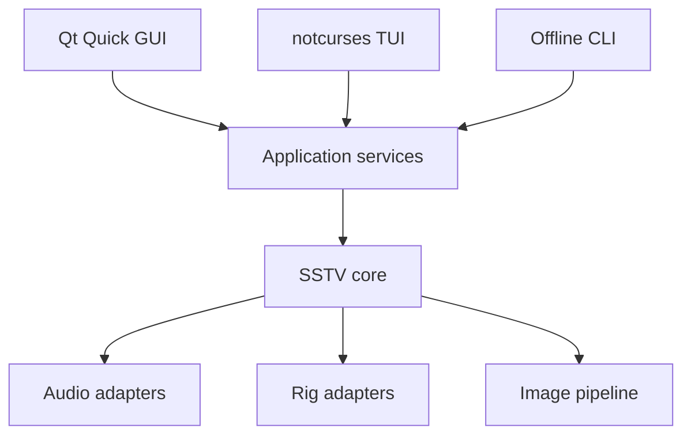
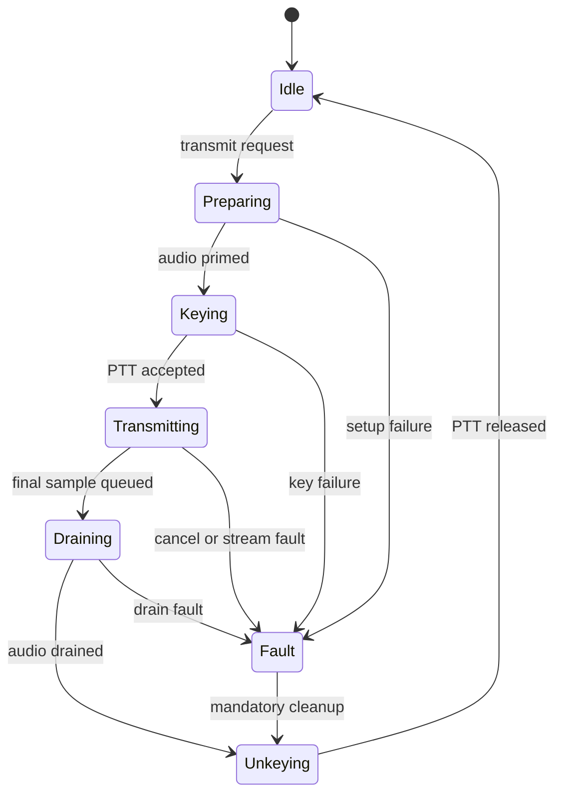

# Architecture

## 1. Design shape

The decoder, encoder, image pipeline, audio abstraction, and rig abstraction are shared
services. GUI, TUI, and CLI are adapters.

The code remains a modular monolith through 1.0. A daemon/RPC split can be added later,
but is not required merely to share implementation between frontends.

## 2. Planned source boundaries

| Module | Responsibility | Forbidden dependencies |
| --- | --- | --- |
| `core` | Mode descriptors, events, immutable snapshots, clocks, errors | Qt, audio servers, rig libraries |
| `dsp` | Filters, NCO, PLL, resampling, correlation, FFT wrappers | UI and rig control |
| `analog` | VIS, FSK ID, analogue encoders and decoders | UI |
| `digital` | HamDRM and KG-STV framing/modems | UI |
| `image` | Bounded libvips raster recipes and immutable RGB8 output | Radio control, Qt, audio, protocol constants |
| `audio` | Backend/device discovery, bounded rings, and stream lifecycle | UI widgets, Qt, rig control |
| `rig` | flrig, rigctld, direct Hamlib, manual/VOX providers | DSP implementation |
| `app` | Session orchestration, settings, gallery, TX state machine | Concrete GUI widgets |
| `apps/gui` | Qt models, QML, scene-graph renderers | Direct hardware access |
| `apps/tui` | notcurses models and terminal renderers | Direct hardware access |
| `apps/cli` | Offline commands and diagnostics | Live PTT by default |

Dependencies point inward. Frontends receive snapshots and issue typed commands.

## 3. Thread model

### Audio callback

One callback per active miniaudio device:

- RX: copy interleaved input/channel selection into a preallocated SPSC ring.
- TX: copy precomputed/generated mono samples from a preallocated SPSC ring into the
  selected output channel(s).
- Update atomic frame, overrun, underrun, and monotonic timestamp counters.

It may not allocate, lock, wait, log, call FFTW planning, touch the filesystem, key PTT,
or invoke a frontend.

### DSP worker

- Drains capture blocks.
- Applies conditioning and the active detector/decoder graph.
- Publishes bounded-rate spectrum/waveform snapshots.
- Publishes decoded scanline or image-block messages.
- Produces TX blocks ahead of the audio callback.

FFTW plans and liquid-dsp objects are created/reconfigured while streams are stopped or
on a control worker, never inside the callback.

### Image worker

- Evaluates libvips processing recipes.
- Produces immutable RGBA previews and mode-sized TX frames.
- Encodes/decodes compressed digital payload images.
- Writes gallery files through the application service.

M1B implements the offline preparation portion as `sstv_image` with alias `sstv::image`.
It is the only target that links `vips-cpp`. Its public value types describe load limits,
crop, fit, background, source facts, typed failures, and the final immutable `Rgb8Frame`;
no libvips or frontend type crosses the boundary.

The deterministic raster recipe resolves a local regular file, selects the actual native
JPEG or PNG loader, validates header limits and page state, applies EXIF orientation,
validates an oriented-source crop, converts a valid embedded ICC profile to sRGB, assumes
unprofiled grayscale/RGB is sRGB, and rejects unprofiled CMYK. It then premultiplies
alpha, applies Lanczos resize with contain or centered cover geometry, composites over
the requested background, and materializes only the exact-size three-channel RGB8 frame.
Atomic stripped PNG publication remains in the image boundary. Martin M1 encoding and
Scottie S1 encoding share a mode-neutral sequential RGB schedule and encoder. A central
registry-backed offline TX service validates capability and frame dimensions before
selecting the built-in strategy. Test-pattern and image commands use that same service;
PCM16 WAV publication remains in the existing offline-audio API.

M1D keeps the image boundary output as immutable sRGB RGB8 and performs protocol colour
conversion inside the analogue encoder boundary. Robot 36 uses immutable full-resolution
luma plus 2 by 2 subsampled red-difference and blue-difference planes. Its fixed-point
conversion, averaging, even/odd component selection, and alternating line descriptor are
separate from the sequential-RGB model. The existing central offline TX service selects
the Robot strategy without exposing protocol, libvips, or Qt types across boundaries.

M1E adds a separate paired-line analogue strategy for PD120. The image boundary still
produces immutable sRGB RGB8. Inside the analogue boundary, PD120 conversion preserves
two independent full-width luma rows and derives one full-width vertically averaged
red-difference plane and one full-width vertically averaged blue-difference plane for
each source-row pair. The immutable paired-line descriptor records the complete fixed and
scan schedule without changing the sequential-RGB or Robot 36 scheduling models. The
central offline TX service selects the PD120 strategy and returns the same typed tone-event
stream consumed by the existing renderer and WAV writer.

M1F adds optional analogue FSK ID as a mode-neutral suffix composed only after the central
offline TX service has produced an accepted base-mode event stream. A validated immutable
identifier and typed transmission options control the suffix. With no identifier, the
compatibility overload returns the exact M1E event stream. With an identifier, the base
events and evidence-backed suffix form one event stream so the existing renderer preserves
oscillator phase across the boundary.

The M1F WAV inspector is a read-only offline/core service. It accepts bounded, nonsymlink
regular local files and streams mono PCM16 sample statistics in fixed blocks. It parses
RIFF chunks with checked offsets and explicit format validation; it does not detect SSTV
modes, decode images, run spectral processing, play audio, or access radio control.

M1G adds `sstv::app` as a Qt-free offline TX editor service over the accepted image,
analogue, scheduling, WAV publication, and WAV inspection boundaries. A typed request
contains the registry mode ID, local input, preparation recipe, sample rate, and optional
validated FSK ID. A completed immutable snapshot contains the prepared RGB8 frame, source
facts, exact combined transmission, cumulative frame count, and bounded projected WAV
size. The service retains at most 700,000 tone events per prepared job and rejects RIFF
size overflow before publication.

The Qt adapter runs preparation, rendering/export, and inspection on a bounded worker
pool. Monotonic request revisions invalidate the prior preview immediately and prevent a
late completion from replacing newer state. A thread-safe image provider copies each
completed immutable RGB8 snapshot once into a revisioned `QImage`; QML uses the revision
in the provider URL with caching and smoothing disabled. QML contains no mode dimensions,
protocol timing, image processing, FSK framing, waveform generation, WAV writing, or WAV
parsing. M1G has no audio, radio-control, or PTT dependency.

M2A adds `sstv_audio` with alias `sstv::audio`. Its public header contains only project
backend, direction, identity, capability, transport, diagnostic, and immutable snapshot
values. Miniaudio and operating-system types stay in the private adapter, and
`sstv_core`, `sstv_image`, and `sstv_app` do not link the audio target.

Discovery creates one explicit miniaudio context per requested backend. A failed backend
does not discard another backend's devices. A provider seam makes unit tests independent
of host hardware. Refreshes are serialized, build a complete private result, and publish
one immutable generation only when at least one real backend succeeds. Cancellation and
total failure preserve the previous valid snapshot. M2A never creates a `ma_device`,
stream, callback, playback path, or capture path.

M2B adds a fixed-capacity mono float32 SPSC ring and a typed `AudioStream` lifecycle to
`sstv_audio`. The producer and consumer publish monotonically increasing positions with
release stores and acquire loads. Playback underruns preserve timing by filling every
missing frame with zero. Capture overruns preserve already-buffered ordered frames and
drop only excess incoming frames. Counters use lock-free 64-bit atomics and wrap modulo
2^64; snapshots are constructed only on the control thread.

The callback owns no resources. It copies bounded blocks through construction-time
scratch storage, applies either one selected output channel or explicit all-channel
duplication, extracts one explicitly selected capture channel, and updates atomic flags
and counters. It cannot allocate, lock, wait, log, format, throw, access files or
networks, initialize or stop a device, call UI code, or access radio/PTT state.

`AudioStream` resolves the exact M2A backend, direction, identity, and discovery
generation before opening. Missing, stale, malformed, wrong-direction, or colliding
identities fail without default or named-device substitution. Control-thread transitions
are closed, opening, opened, primed, running, stopping, closed, with typed faulted exits.
Start requires the configured playback prefill; capture-only priming requires no sample
data. Stop waits in the private adapter until callbacks cannot run, then close destroys
the device before its context, rings, and callback state. Disconnect notifications only
publish atomic fault state and never reopen a device.

Deterministic tests inject an adapter and advance callbacks without clocks or hardware.
The separately labelled integration test opens only miniaudio's null backend. No CLI or
GUI operation can open a stream in M2B, and no SSTV encoder, radio control, or PTT path is
connected to this boundary.

### Rig worker

- Owns XML-RPC, TCP, or libhamlib calls.
- Serialises state transitions and retries.
- Publishes connection/PTT readback snapshots.
- Never waits on the DSP or UI thread.

### UI/render thread

Consumes immutable or double-buffered snapshots. Rendering cadence is independent of
audio and decoding cadence.

## 4. Receive data path

1. Capture the explicitly selected channel as float32.
2. DC removal, level measurement, optional hum notches, and a bounded band-pass.
3. Convert the SSTV tone to a complex baseband/quadrature representation.
4. Estimate instantaneous tone frequency with confidence.
5. Run VIS matched detectors and manual/automatic mode selection.
6. Detect sync pulses and feed a line-clock PLL/robust timing estimator.
7. Correct tracked frequency offset and sample-clock/slant error.
8. Resample colour intervals into mode pixels.
9. Convert mode colour space to linear working RGB, then display/output colour space.
10. Publish lines without exposing a concurrently mutable frame.
11. Save the completed image, metadata, and optionally the source audio.

Automatic mode detection without valid VIS is a later confidence-ranked classifier; it
must not destabilise a locked decoder.

## 5. Transmit data path

1. Load and validate source media.
2. Apply a non-destructive libvips recipe.
3. Composite template layers and convert to exact mode dimensions/colour encoding.
4. Produce an immutable TX frame and duration/bandwidth preview.
5. Generate a WAV or in-memory sample stream using the same encoder.
6. Open and prime the selected output device.
7. Request PTT, wait the configured pre-key interval, then release audio to the callback.
8. Drain the final audio and configured tail.
9. Unkey and confirm/read back when the provider supports it.

Cancelling or faulting jumps to the unkey path; it never jumps directly to idle.

## 6. PTT state machine

Provider order is user-configurable:

1. flrig XML-RPC (`rig.set_ptt`/`rig.get_ptt`).
2. Hamlib `rigctld` TCP (`T`/`t` commands).
3. Direct libhamlib.
4. Manual indication or VOX with no software PTT.

An RAII transmit lease and process-level shutdown guard both request unkeying. The rig
worker retries according to a bounded policy and presents an unresolved-PTT warning if
confirmation is impossible.

## 7. Audio backends and devices

The M2A audio service independently probes each requested miniaudio API and returns a
normalised immutable snapshot containing:

- Backend and server identity.
- Project-owned backend-and-direction device ID plus human name.
- Known native formats, channel counts, and sample rates without opening an endpoint.
- Authoritative transport classification when available, otherwise `unknown`.
- Current default marker without converting it into an implicit permanent choice.

Linux presents PulseAudio/PipeWire-Pulse, JACK/PipeWire-JACK, and ALSA choices rather
than hiding them behind one opaque default. PipeWire is reported through the
compatibility API actually used. FreeBSD can expose OSS, OpenBSD can expose sndio and
audio(4), and NetBSD can expose audio(4), subject to pinned miniaudio platform support.
The sndio backend is compiled but M2A refuses enumeration because the pinned enumeration
path opens audio endpoints. BSD runtime behavior remains unverified by Linux CI.

Identity serialization uses only the initialized field for the active backend. Raw union
storage, padding, pointers, names, and enumeration indices are never identity material.
Direction is part of identity, so capture and playback endpoints remain distinct.
Nonempty PulseAudio API names are marked persistent. ALSA, JACK, OSS, sndio, audio(4),
null, and collisions are conservatively session-only. Exact duplicate identities remain
visible and are collision-marked. Device names are untrusted bytes and the CLI escapes
controls and invalid UTF-8 before writing terminal output.

M2A does not automatically select or persist a device. USB is never inferred from a
display name; the public classifier seam permits later authoritative platform enrichment
without adding libudev here. The null backend appears only when explicitly requested and
is labelled diagnostic rather than hardware.

The internal nominal rate is 48 kHz float32 mono. Device conversion is explicit and
measured; adaptive sample-clock correction belongs to DSP rather than the GUI.

## 8. Rendering

The decoded image uses a double-buffered RGBA surface. Scanline messages are coalesced to
the display refresh interval and uploaded through a custom `QQuickItem` scene-graph node.

The waterfall is a circular row buffer and texture. The DSP worker supplies power rows;
the renderer applies palette, level, and zoom. The waveform receives min/max buckets
rather than every audio sample.

Do not adopt preliminary Qt rendering APIs when stable scene-graph nodes and textures
satisfy the requirement.

## 9. Configuration and files

Versioned TOML stores user preferences. Runtime data uses platform/XDG directories:

- Config: devices, backends, rig profiles, station identity, UI preferences.
- Data: templates, received gallery, exported images.
- State: last session and recoverable in-progress digital blocks.
- Cache: FFTW wisdom, thumbnails, temporary TX renders.

Files include an explicit schema version. Unknown keys survive load/save where practical.
Atomic replace is required for configuration and metadata sidecars.

## 10. Error model

Library layers return typed errors with operation, backend, recoverability, and a
human-readable message. Frontends decide presentation. A recoverable device loss is not a
process abort; a violated invariant is.

Logs use structured fields and monotonic timing but never run in a real-time callback.
