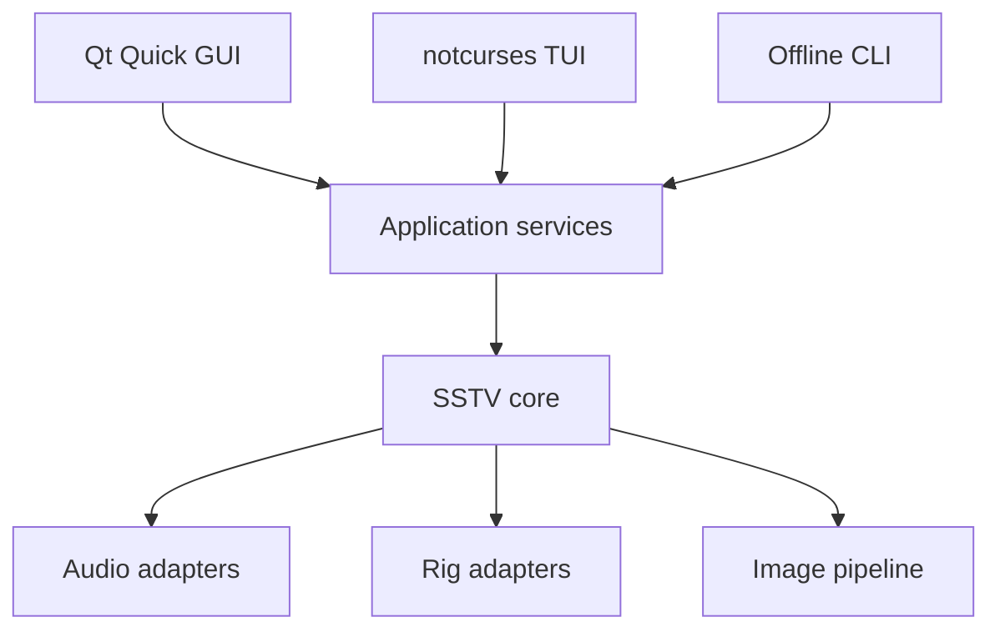
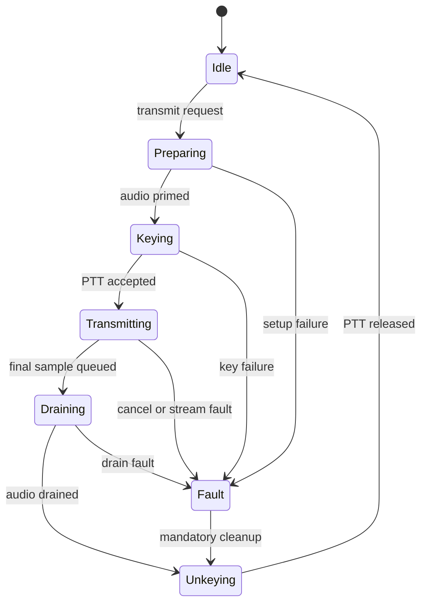

# Architecture

## 1. Design shape

The decoder, encoder, image pipeline, audio abstraction, and rig abstraction are shared
services. GUI, TUI, and CLI are adapters.

The code remains a modular monolith through 1.0. A daemon/RPC split can be added later,
but is not required merely to share implementation between frontends.

## 2. Planned source boundaries

| Module | Responsibility | Forbidden dependencies |
| --- | --- | --- |
| `core` | Mode descriptors, events, immutable snapshots, clocks, errors | Qt, audio servers, rig libraries |
| `dsp` | Filters, NCO, PLL, resampling, correlation, FFT wrappers | UI and rig control |
| `analog` | VIS, FSK ID, analogue encoders and decoders | UI |
| `digital` | HamDRM and KG-STV framing/modems | UI |
| `image` | Bounded libvips raster recipes and immutable RGB8 output | Radio control, Qt, audio, protocol constants |
| `audio` | miniaudio contexts, devices, streams, ring buffers | UI widgets |
| `rig` | flrig, rigctld, direct Hamlib, manual/VOX providers | DSP implementation |
| `app` | Session orchestration, settings, gallery, TX state machine | Concrete GUI widgets |
| `apps/gui` | Qt models, QML, scene-graph renderers | Direct hardware access |
| `apps/tui` | notcurses models and terminal renderers | Direct hardware access |
| `apps/cli` | Offline commands and diagnostics | Live PTT by default |

Dependencies point inward. Frontends receive snapshots and issue typed commands.

## 3. Thread model

### Audio callback

One callback per active miniaudio device:

- RX: copy interleaved input/channel selection into a preallocated SPSC ring.
- TX: copy precomputed/generated mono samples from a preallocated SPSC ring into the
  selected output channel(s).
- Update atomic frame, overrun, underrun, and monotonic timestamp counters.

It may not allocate, lock, wait, log, call FFTW planning, touch the filesystem, key PTT,
or invoke a frontend.

### DSP worker

- Drains capture blocks.
- Applies conditioning and the active detector/decoder graph.
- Publishes bounded-rate spectrum/waveform snapshots.
- Publishes decoded scanline or image-block messages.
- Produces TX blocks ahead of the audio callback.

FFTW plans and liquid-dsp objects are created/reconfigured while streams are stopped or
on a control worker, never inside the callback.

### Image worker

- Evaluates libvips processing recipes.
- Produces immutable RGBA previews and mode-sized TX frames.
- Encodes/decodes compressed digital payload images.
- Writes gallery files through the application service.

M1B implements the offline preparation portion as `sstv_image` with alias `sstv::image`.
It is the only target that links `vips-cpp`. Its public value types describe load limits,
crop, fit, background, source facts, typed failures, and the final immutable `Rgb8Frame`;
no libvips or frontend type crosses the boundary.

The deterministic raster recipe resolves a local regular file, selects the actual native
JPEG or PNG loader, validates header limits and page state, applies EXIF orientation,
validates an oriented-source crop, converts a valid embedded ICC profile to sRGB, assumes
unprofiled grayscale/RGB is sRGB, and rejects unprofiled CMYK. It then premultiplies
alpha, applies Lanczos resize with contain or centered cover geometry, composites over
the requested background, and materializes only the exact-size three-channel RGB8 frame.
Atomic stripped PNG publication remains in the image boundary. Martin M1 encoding and
Scottie S1 encoding share a mode-neutral sequential RGB schedule and encoder. A central
registry-backed offline TX service validates capability and frame dimensions before
selecting the built-in strategy. Test-pattern and image commands use that same service;
PCM16 WAV publication remains in the existing offline-audio API.

### Rig worker

- Owns XML-RPC, TCP, or libhamlib calls.
- Serialises state transitions and retries.
- Publishes connection/PTT readback snapshots.
- Never waits on the DSP or UI thread.

### UI/render thread

Consumes immutable or double-buffered snapshots. Rendering cadence is independent of
audio and decoding cadence.

## 4. Receive data path

1. Capture the explicitly selected channel as float32.
2. DC removal, level measurement, optional hum notches, and a bounded band-pass.
3. Convert the SSTV tone to a complex baseband/quadrature representation.
4. Estimate instantaneous tone frequency with confidence.
5. Run VIS matched detectors and manual/automatic mode selection.
6. Detect sync pulses and feed a line-clock PLL/robust timing estimator.
7. Correct tracked frequency offset and sample-clock/slant error.
8. Resample colour intervals into mode pixels.
9. Convert mode colour space to linear working RGB, then display/output colour space.
10. Publish lines without exposing a concurrently mutable frame.
11. Save the completed image, metadata, and optionally the source audio.

Automatic mode detection without valid VIS is a later confidence-ranked classifier; it
must not destabilise a locked decoder.

## 5. Transmit data path

1. Load and validate source media.
2. Apply a non-destructive libvips recipe.
3. Composite template layers and convert to exact mode dimensions/colour encoding.
4. Produce an immutable TX frame and duration/bandwidth preview.
5. Generate a WAV or in-memory sample stream using the same encoder.
6. Open and prime the selected output device.
7. Request PTT, wait the configured pre-key interval, then release audio to the callback.
8. Drain the final audio and configured tail.
9. Unkey and confirm/read back when the provider supports it.

Cancelling or faulting jumps to the unkey path; it never jumps directly to idle.

## 6. PTT state machine

Provider order is user-configurable:

1. flrig XML-RPC (`rig.set_ptt`/`rig.get_ptt`).
2. Hamlib `rigctld` TCP (`T`/`t` commands).
3. Direct libhamlib.
4. Manual indication or VOX with no software PTT.

An RAII transmit lease and process-level shutdown guard both request unkeying. The rig
worker retries according to a bounded policy and presents an unresolved-PTT warning if
confirmation is impossible.

## 7. Audio backends and devices

The audio service creates miniaudio contexts for available APIs and returns a normalised
list containing:

- Backend and server identity.
- Stable backend-specific device ID plus human name.
- Input/output capabilities, channel counts, native formats, and sample rates.
- Best-effort USB/built-in classification.
- Current default marker without converting it into an implicit permanent choice.

Linux presents PulseAudio/PipeWire-Pulse, JACK/PipeWire-JACK, and ALSA choices rather
than hiding them behind one opaque “default”. FreeBSD uses OSS, OpenBSD prefers sndio,
and NetBSD uses audio(4), subject to what the installed miniaudio build exposes.

The internal nominal rate is 48 kHz float32 mono. Device conversion is explicit and
measured; adaptive sample-clock correction belongs to DSP rather than the GUI.

## 8. Rendering

The decoded image uses a double-buffered RGBA surface. Scanline messages are coalesced to
the display refresh interval and uploaded through a custom `QQuickItem` scene-graph node.

The waterfall is a circular row buffer and texture. The DSP worker supplies power rows;
the renderer applies palette, level, and zoom. The waveform receives min/max buckets
rather than every audio sample.

Do not adopt preliminary Qt rendering APIs when stable scene-graph nodes and textures
satisfy the requirement.

## 9. Configuration and files

Versioned TOML stores user preferences. Runtime data uses platform/XDG directories:

- Config: devices, backends, rig profiles, station identity, UI preferences.
- Data: templates, received gallery, exported images.
- State: last session and recoverable in-progress digital blocks.
- Cache: FFTW wisdom, thumbnails, temporary TX renders.

Files include an explicit schema version. Unknown keys survive load/save where practical.
Atomic replace is required for configuration and metadata sidecars.

## 10. Error model

Library layers return typed errors with operation, backend, recoverability, and a
human-readable message. Frontends decide presentation. A recoverable device loss is not a
process abort; a violated invariant is.

Logs use structured fields and monotonic timing but never run in a real-time callback.
